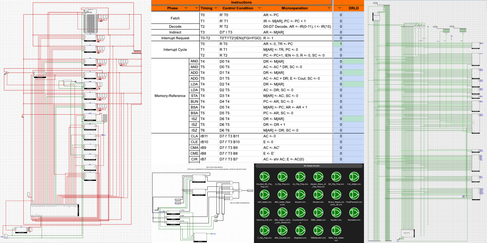

# Basic-Computer

<p>
  Mano Machine is a 16 Bit computer provided in the books by Morris Mano, which is able to execute programs like Fibonacci, Factorial, and Guess the Number Game. This repository is an implementation of 
  <a href="https://api.amu.ac.in/storage/file/30/under-graduate/syll/1753945183.pdf#page=16" data-fallback="/University/Syllabus.pdf#page=16">Digital Logic and Circuit Design (COC2072)</a>, 
  <a href="https://api.amu.ac.in/storage/file/30/under-graduate/syll/1753945183.pdf#page=30" data-fallback="/University/Syllabus.pdf#page=30">Digital Design & Simulation Lab (COC2922)</a> and 
  <a href="https://api.amu.ac.in/storage/file/30/under-graduate/syll/1753945183.pdf#page=19" data-fallback="/University/Syllabus.pdf#page=19">Computer Architecture (COC2082)</a>.
</p>

---



* [Decoded Instructions](https://docs.google.com/spreadsheets/d/1iQ1Zzdj7JYTmBiXy1o-t-n2Hny4eIJqiO4zj733_0VQ/edit?usp=sharing)
* Books: 
    * Computer System Architecture - M. Morris Mano
    * Digital Logic and Computer Design - M. Morris Mano
<!-- * Similar project: [computer-8bits](https://github.com/leonicolas/computer-8bits) -->
<!-- * Lectures: [Bharat Acharya Education (Intel 8085)](https://www.youtube.com/watch?v=oY_ojcLWm80&list=PLfzBO7vcQZ1JTpio2FEeII_70jzAGh6kx&index=13&t=601s) -->
* Note: For looped circuits $(Q = f(Q))$, the sim may not be able to find the correct state, hence RESET pin is used to make initial Q as 0 - similar to setting a base case for recursion.
* Logism provides features like getting truth-table, running txt-tests, etc.
* Particulars about the version of Logisim used:
    * Product: Logisim-evolution v4.0.0
    * Runs on: Java HotSpot(TM) 64-Bit Server VM v21.0.4
    * Compiled: 2025-09-07T09:17:48+0200
    * Build ID: main/00b4b30e
    * Built on: Java HotSpot(TM) 64-Bit Server VM v21.0.4
* We may create Memory from scratch as well, but logisim allows us to load programs using Hex files.
* This repo was made such that everything feels very accessible, however logisim doesn't allow a library to be used if it was used in an already imported library. So if you are trying to re-create this probably should make everything in a single file with different circuits. Or forcefully import by writing the import statement in the .circ file.
* Pin order in logisim of the imported circuit depends on the build circuit.
* This project can be later extended to make the processor for [Apple 1](http://visual6502.org/).
* If you find any issues, inconsistencies in notation, some logical flaw, or anything worth mentioning, please let me know. Pull requests are always welcomed.
* Computer Specifics: Von Neumann Architecture, Accumulator-Based (Leaning toward CISC), Hardwired Control Unit, Isolated I/O, Fixed-Length Instructions, 4K Words (8KB RAM), SISD (Single Instruction Single Data), all registers are falling-edge triggering.


## How to Run
1. Ensure you have [Logisim-evolution v4.0.0+](https://github.com/logisim-evolution/logisim-evolution) installed.
2. Clone this repo.
3. Open `src/04-datapath/BasicComputer.circ`.
4. To run a program: Right-click the RAM component -> **Load Image** -> Select your `.hex` file.
5. Press `Ctrl + K` to start the execution.


## Structure:
```text
.
├── Banner.png
├── README.md
├── shortcuts.svg
├── src
│   ├── 00-Simple Circuits
│   │   ├── 16Bit_Adder.circ
│   │   ├── 16Bit_Full_Adder.circ
│   │   ├── 16BitMux4x1.circ
│   │   ├── 4Bit_Adder_Carry_Look_Ahead.circ
│   │   ├── 4Bit_Adder_Ripple.circ
│   │   ├── 4Bit_Counter.circ
│   │   ├── Binary_Ripple_Counter_JK.circ
│   │   ├── Clocked_RS_Flip_Flop.circ
│   │   ├── Counter42513.circ
│   │   ├── D_Flip_Flop.circ
│   │   ├── Decoders.circ
│   │   ├── FinalPractical.circ
│   │   ├── Full_Adder.circ
│   │   ├── Half_Adder.circ
│   │   ├── JK_Flip_Flop.circ
│   │   ├── Master_Slave_JK_Flip_Flop.circ
│   │   ├── Memory_Cell.circ
│   │   ├── Mux2x1.circ
│   │   ├── Mux4x1.circ
│   │   ├── Mux8x1.circ
│   │   ├── Registers.circ
│   │   ├── SR_Flip_Flop.circ
│   │   └── T_Flip_Flop.circ
│   ├── 01-ALSU
│   │   ├── ALSU_Test.txt
│   │   ├── ALSU.circ
│   │   ├── ALSU.png
│   │   ├── Arithmetic_Unit.circ
│   │   ├── Arithmetic_Unit.png
│   │   ├── Logic_Unit.circ
│   │   └── Logic_Unit.png
│   ├── 02-Memory
│   │   ├── Memory_Cell.png
│   │   └── Memory.png
│   ├── 03-Control-Unit
│   │   ├── AC.circ
│   │   ├── ALU_Control.circ
│   │   ├── AR.circ
│   │   ├── Control Functions and Microoperations.png
│   │   ├── Control_Unit_Test.txt
│   │   ├── Control_Unit.circ
│   │   ├── Control_Unit.png
│   │   ├── DR.circ
│   │   ├── E.circ
│   │   ├── EnableFFs.circ
│   │   ├── IO.circ
│   │   ├── IR.circ
│   │   ├── Mem.circ
│   │   ├── PC.circ
│   │   ├── SC.circ
│   │   └── TR.circ
│   ├── 04-Datapath
│   │   ├── BasicComputer.circ
│   │   ├── BasicComputer.png
│   │   ├── Circuits Associated with AC.png
│   │   ├── Full Computer Operation.png
│   │   ├── IEN.png
│   │   ├── Interrupt Cycle.png
│   │   ├── Registers.circ
│   │   └── Registers.png
│   └── Programs
│       ├── assembler.py
│       ├── Factorial.asm
│       ├── Factorial.hex
│       ├── Factorial.mov
│       ├── Fibonacci.asm
│       ├── Fibonacci.hex
│       ├── Fibonacci.mov
│       ├── GuessGame.asm
│       ├── GuessGame.hex
│       ├── GuessGame.mov
│       ├── Sum Direct Memory.asm
│       ├── Sum Direct Memory.hex
│       └── Sum Direct Memory.mov
└── University
    ├── Computer Architecture
    │   ├── Architecture(Full content from Unit 1 to 4).pdf
    │   ├── CA_Complete.pdf
    │   └── Computer Architecture.pdf
    ├── Digital Logic and System Design
    │   ├── Unit I.pdf
    │   ├── Unit II.pdf
    │   ├── Unit III.pdf
    │   └── Unit IV.pdf
    └── Syllabus.pdf

11 directories, 80 files

```

## Assembler:


1. **Write your code**: Save your assembly program as a plain text file (e.g., `program.asm`).
```assembly
/ A simple program to add two numbers
ORG 10
START,  LDA NUM1   / Load first number into AC
        ADD NUM2   / Add second number to AC
        STA RESULT / Store the sum
        HLT        / Halt execution
NUM1,   DEC 25     / Store decimal 25
NUM2,   DEC -5     / Store decimal -5
RESULT, HEX 0      / Room for the result
END

```


2. **Assemble the code**: Run the python tool from your command line:
```bash
python assembler.py program.asm

```


3. **Output**: This creates `program.hex`. It automatically starts with `v2.0 raw` and pre-fills unmapped addresses up to your code segment with `0000`, matching exactly what Logisim expects.
4. **Load into Logisim**: Right-click the **RAM** component in Logisim, choose **Load Image...**, select `program.hex`, and the instruction words will be cleanly populated in your simulation memory.

